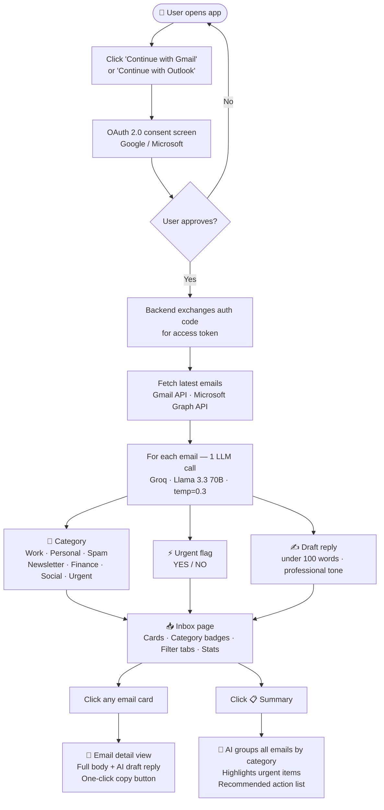

<div align="center">

# ✦ AI Mail Manager

### Your inbox, understood in seconds.

Connect Gmail or Outlook → AI reads, categorizes, flags urgent emails, and drafts replies — all free, all instant.

[](https://ai-email-manager-seven.vercel.app)
[](https://render.com)
[](https://console.groq.com)
[](LICENSE)

</div>

---

## ✨ What it does

| Feature | Description |
|---|---|
| 🗂 **Auto Categorize** | Sorts every email into Work, Personal, Newsletter, Finance, Social, Spam, or Urgent |
| ⚡ **Flag Urgent** | AI detects time-sensitive emails and marks them instantly |
| ✍️ **Draft Replies** | Writes a professional reply for every single email — ready to copy |
| 📋 **Daily Digest** | One-click summary of your whole inbox grouped by category with action items |

> 🔒 **100% read-only** — the app never sends, deletes, or modifies any emails.

---

## 🔄 How it works — full flow



---

## 🖥️ App Screens — what you'll see

### 1️⃣ Landing Page
Dark hero screen with two connect buttons. One click — OAuth does the rest.

```
╔═════════════════════════════════════════════════════╗
║                                                     ║
║      • Powered by Groq · Llama 3.3 · Free to use   ║
║                                                     ║
║         Your Inbox,                                 ║
║         Managed by AI   ← violet/pink gradient      ║
║                                                     ║
║     ✦ Auto Categorize   ✦ Flag Urgent               ║
║     ✦ Draft Replies     ✦ Daily Summary             ║
║                                                     ║
║   ┌─────────────────────────────────────────┐       ║
║   │  ✉  Continue with Gmail                 │       ║
║   └─────────────────────────────────────────┘       ║
║   ┌─────────────────────────────────────────┐       ║
║   │  🔷 Continue with Outlook               │       ║
║   └─────────────────────────────────────────┘       ║
║                                                     ║
║   🔒 Read-only · No emails stored · Open source     ║
╚═════════════════════════════════════════════════════╝
```

---

### 2️⃣ Inbox — after AI processes your emails

```
╔═════════════════════════════════════════════════════╗
║  ✦ AI Mail  [gmail ●]  [10]    📋 Summary  Logout   ║
╠═════════════════════════════════════════════════════╣
║  ┌─────────┐  ┌─────────┐  ┌─────────┐  ┌───────┐  ║
║  │   10    │  │    2    │  │    4    │  │   1   │  ║
║  │  TOTAL  │  │ URGENT  │  │  WORK   │  │PERSON.│  ║
║  └─────────┘  └─────────┘  └─────────┘  └───────┘  ║
╠═════════════════════════════════════════════════════╣
║  [All·10] [Urgent·2] [Work·4] [Newsletter·2] ...    ║
╠═════════════════════════════════════════════════════╣
║  ┌───────────────────────────────────────────────┐  ║
║  │ 🟣  Google           ⚡Urgent  💼Work  2h ago  │  ║
║  │     Your account security alert           ›  │  ║
║  ├───────────────────────────────────────────────┤  ║
║  │ 🔵  Netflix           💰Finance   Yesterday   │  ║
║  │     Your invoice is ready                 ›  │  ║
║  ├───────────────────────────────────────────────┤  ║
║  │ 🟠  Amazon            💼Work        Mar 5     │  ║
║  │     Your order has shipped                ›  │  ║
║  ├───────────────────────────────────────────────┤  ║
║  │ 🟢  GitHub            💼Work        Mar 4     │  ║
║  │     New pull request opened               ›  │  ║
║  └───────────────────────────────────────────────┘  ║
╚═════════════════════════════════════════════════════╝
```

---

### 3️⃣ Email Detail — full message + AI draft reply

```
╔═════════════════════════════════════════════════════╗
║  ← Back  |  Your account security alert             ║
╠═════════════════════════════════════════════════════╣
║  ┌─────────────────────────────────────────────┐   ║
║  │  🟣  ⚡ Urgent   💼 Work                    │   ║
║  │      Your account security alert            │   ║
║  │      security@google.com  ·  2 hours ago    │   ║
║  └─────────────────────────────────────────────┘   ║
║                                                     ║
║  MESSAGE ─────────────────────────────────────────  ║
║  We noticed a new sign-in to your Google Account    ║
║  from a new device. If this was you, no action      ║
║  needed. If not, secure your account now...         ║
║                                                     ║
║  ✨ AI DRAFT REPLY ──────────────── [Copy Reply]   ║
║  ┌─────────────────────────────────────────────┐   ║
║  │ Thank you for the security notification.    │   ║
║  │ I've reviewed the sign-in activity and it   │   ║
║  │ was me accessing from a new device. No      │   ║
║  │ action required from your end. Thanks!      │   ║
║  └─────────────────────────────────────────────┘   ║
╚═════════════════════════════════════════════════════╝
```

---

### 4️⃣ Daily Digest — AI summary of entire inbox

```
╔═════════════════════════════════════════════════════╗
║  📋  Daily Digest                                   ║
║       AI-generated summary of your inbox            ║
╠═════════════════════════════════════════════════════╣
║  ✨ AI Summary                                      ║
║  ────────────────────────────────────────────────   ║
║  You have 10 emails across 5 categories.            ║
║                                                     ║
║  ⚡ URGENT (2):                                     ║
║  • Google security alert — verify recent login      ║
║  • Invoice overdue — action needed by Friday        ║
║                                                     ║
║  💼 WORK (4): Project update, team meeting invite,  ║
║  client follow-up, deployment notification          ║
║                                                     ║
║  📰 NEWSLETTERS (2): TechCrunch, Morning Brew       ║
║  💰 FINANCE (1): Netflix monthly invoice            ║
║  🗑  SPAM (1): Promotional offer                    ║
║                                                     ║
║  ✅ RECOMMENDED ACTIONS:                            ║
║  1. Review the Google security alert immediately    ║
║  2. Pay the overdue invoice before Friday           ║
║  3. Reply to the client follow-up email             ║
╚═════════════════════════════════════════════════════╝
```

---

## 🧠 How the AI works under the hood

For every email, a **single LLM call** returns all three outputs at once — efficient and fast:

```
Input ──────────────────────────────────────────────────────
  Subject: "Your account security alert"
  Sender:  security@google.com
  Body:    "We noticed a new sign-in..." (first 500 chars)

         ↓  Groq · Llama 3.3 70B · temperature=0.3

Output ─────────────────────────────────────────────────────
  CATEGORY: Work
  URGENT:   YES
  REPLY:    Thank you for the notification. I've reviewed...
```

For the **Daily Summary**, up to 20 emails are passed together. The LLM groups them by category, surfaces urgent items, and produces a recommended action list.

---

## 🛠 Tech Stack

| Layer | Technology | Purpose |
|---|---|---|
| **Frontend** | React 18 + Vite | UI framework |
| **Styling** | Tailwind CSS + Inline Styles | Dark theme, animations |
| **Routing** | React Router v6 | SPA navigation |
| **Backend** | FastAPI (Python) | REST API server |
| **LLM** | Groq API — Llama 3.3 70B | Categorize · Flag · Reply · Summarize |
| **Gmail** | Google OAuth 2.0 + Gmail API v1 | Read Gmail inbox |
| **Outlook** | MSAL + Microsoft Graph API | Read Outlook inbox |
| **Frontend Deploy** | Vercel | Instant global CDN |
| **Backend Deploy** | Render | Free Python hosting |

---

## 📁 Project Structure

```
ai-email-manager/
│
├── backend/
│   ├── main.py              # FastAPI app — all routes & session management
│   ├── ai_engine.py         # LLM logic — categorize, flag, draft, summarize
│   ├── gmail_client.py      # Gmail OAuth + fetch emails
│   ├── outlook_client.py    # Outlook OAuth + Microsoft Graph API
│   ├── requirements.txt     # Python dependencies
│   └── .env                 # API keys (not committed to git)
│
└── frontend/
    ├── src/
    │   ├── pages/
    │   │   ├── Home.jsx         # Landing — connect Gmail / Outlook
    │   │   ├── Inbox.jsx        # Email list with stats, filters, cards
    │   │   ├── EmailView.jsx    # Single email + AI draft reply
    │   │   └── Summary.jsx      # Daily digest page
    │   ├── components/
    │   │   ├── Navbar.jsx       # Top nav — logo, provider pill, actions
    │   │   ├── EmailCard.jsx    # Email row with hover effects
    │   │   └── CategoryBadge.jsx # Colored category pill
    │   └── api/
    │       └── client.js        # Axios calls to backend
    └── vercel.json              # SPA routing — fixes 404 on refresh
```

---

## ⚙️ Local Setup

### Prerequisites
- Node.js 18+, Python 3.9+
- Free [Groq API key](https://console.groq.com)
- [Google Cloud project](https://console.cloud.google.com) with Gmail API + OAuth credentials

### 1. Clone

```bash
git clone https://github.com/varunsimha35223/ai-email-manager.git
cd ai-email-manager
```

### 2. Backend

```bash
cd backend
python -m venv venv
source venv/bin/activate        # Windows: venv\Scripts\activate
pip install -r requirements.txt
```

Create `backend/.env`:

```env
GROQ_API_KEY=your_groq_key_here

GMAIL_CLIENT_ID=your_google_client_id
GMAIL_CLIENT_SECRET=your_google_client_secret
GMAIL_REDIRECT_URI=http://localhost:8000/auth/gmail/callback

FRONTEND_URL=http://localhost:5173
```

```bash
uvicorn main:app --reload --port 8000
```

### 3. Frontend

```bash
cd frontend
npm install
npm run dev
```

Visit `http://localhost:5173` ✅

---

## 🚀 Deployment

### Backend → Render (free)

| Setting | Value |
|---|---|
| Environment | Python |
| Build Command | `pip install -r requirements.txt` |
| Start Command | `uvicorn main:app --host 0.0.0.0 --port $PORT` |
| Root Directory | `backend` |

Add the same env vars from `.env` in the Render dashboard (use production URLs).

### Frontend → Vercel (free)

| Setting | Value |
|---|---|
| Root Directory | `frontend` |
| Framework | Vite |
| Environment Variable | `VITE_API_URL=https://your-app.onrender.com` |

Vercel auto-deploys on every push to `main`.

---

## 🔑 Environment Variables

| Variable | Where | Description |
|---|---|---|
| `GROQ_API_KEY` | Backend | From [console.groq.com](https://console.groq.com) — free |
| `GMAIL_CLIENT_ID` | Backend | Google Cloud → APIs & Services → Credentials |
| `GMAIL_CLIENT_SECRET` | Backend | Google Cloud → APIs & Services → Credentials |
| `GMAIL_REDIRECT_URI` | Backend | Must match **exactly** in Google Cloud Console |
| `FRONTEND_URL` | Backend | Where to redirect after OAuth (Vercel URL in prod) |
| `VITE_API_URL` | Frontend | Your Render backend URL |

---

## ⚠️ Important Notes

- **Read-only** — OAuth scopes are `gmail.readonly` and `Mail.Read`. Cannot send, delete, or modify anything.
- **No database** — Sessions are in-memory only. Credentials are gone when the server restarts.
- **Completely free** — Groq's free tier handles all AI. No paid API required.
- **Google test users** — While the OAuth app is unverified, only accounts added as test users in Google Cloud Console can connect.

---

## 📄 License

MIT — free to use, fork, and deploy.

---

<div align="center">
  Built with React · FastAPI · Groq · Llama 3.3 70B
</div>
